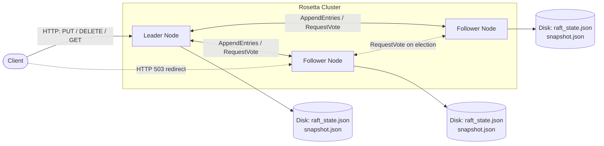
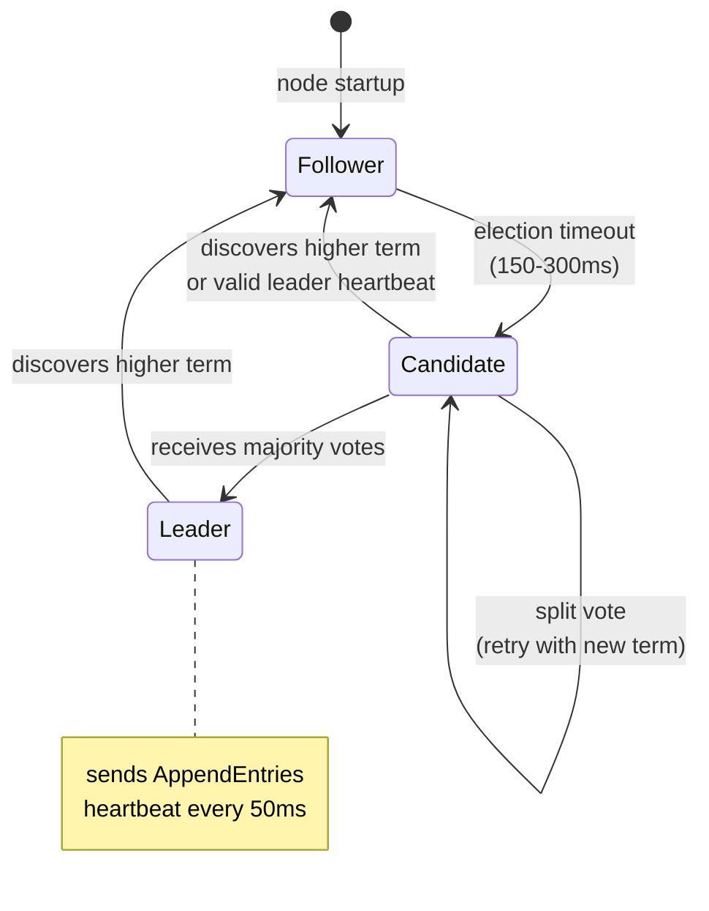

# Rosetta - Distributed Key-Value Store

A distributed key-value store implementation using the Raft consensus algorithm, written in Go, built from scratch as a learning project.

> **Project status: educational implementation — not for production use.**
> The core happy path works (leader election, log replication, HTTP KV API, crash
> recovery), but a full safety review against the Raft paper found confirmed
> violations of Raft's safety properties in several subsystems, most notably log
> compaction. The issues are tracked openly in [KNOWN_ISSUES.md](KNOWN_ISSUES.md),
> with the detailed analysis in
> [docs/safety-review-2026-07-07.md](docs/safety-review-2026-07-07.md).

## Features

- **Raft Consensus**: Leader election with randomized timeouts, log replication with consistency checks, and heartbeats
- **Distributed KV Store**: PUT/GET/DELETE over an HTTP API, with leader-only writes and follower redirects
- **Persistence**: Crash recovery with atomic file writes; state is persisted before RPC replies
- **Log Compaction / InstallSnapshot**: Implemented but currently broken and unwired in production paths — see [KNOWN_ISSUES.md](KNOWN_ISSUES.md) (group A)
- **Read Optimization**: Lease-based local reads on the leader, with known linearizability gaps (group D)
- **Testing Suite**: Unit and integration tests using a deterministic in-memory mock transport

## Quick Start

### Build and Run

```bash
# Build the application
go build -o rosetta main.go

# Run a single node
./rosetta -id=node1 -listen=localhost:8080 -http=localhost:9080

# Run a 3-node cluster
./rosetta -id=node1 -listen=localhost:8080 -http=localhost:9080 -peers=node2:localhost:8081,node3:localhost:8082
./rosetta -id=node2 -listen=localhost:8081 -http=localhost:9081 -peers=node1:localhost:8080,node3:localhost:8082
./rosetta -id=node3 -listen=localhost:8082 -http=localhost:9082 -peers=node1:localhost:8080,node2:localhost:8081
```

### API Usage

```bash
# Store a key-value pair
curl -X PUT http://localhost:9080/kv -d '{"key":"hello","value":"world"}'

# Retrieve a value
curl http://localhost:9080/kv/hello

# Delete a key
curl -X DELETE http://localhost:9080/kv/hello

# Check node status
curl http://localhost:9080/status

# Get current leader
curl http://localhost:9080/leader
```

## Architecture

### Cluster Overview



Writes always go through the Leader; Followers redirect clients via HTTP 503. Each node independently persists its Raft state and KV snapshot for crash recovery.

### Raft State Transitions



Implemented in [`raft/state.go`](raft/state.go). Randomized election timeouts prevent split votes; any node that observes a higher term immediately steps down to Follower.

### Core Components

- **raft/**: Raft consensus algorithm implementation
  - State management (Follower/Candidate/Leader)
  - Log replication and consistency
  - RPC communication (RequestVote, AppendEntries)

- **kvstore/**: Key-value store built on Raft
  - PUT/GET/DELETE operations
  - Client request handling
  - State machine integration

- **network/**: Network communication layer
  - HTTP-based RPC transport
  - Cluster membership and discovery

- **config/**: Configuration management

### Key Design Patterns

- **Leader-Only Writes**: All mutations go through the leader node
- **Apply Channel**: Bridge between Raft consensus and state machine
- **Transport Abstraction**: Support for different transport implementations
- **Mock Testing**: Deterministic testing without network complexity

## Development

### Testing

```bash
# Run all tests
go test ./... -v

# Run unit tests only
go test ./tests/unit/... -v

# Run integration tests only
go test ./tests/integration/... -v

# HTTP-level benchmark (no Go Benchmark functions exist; use the benchmark tool)
# see examples/benchmark/

# Race condition detection
go test -race ./...
```

### API Endpoints

| Method | Endpoint | Description |
|--------|----------|-------------|
| PUT | `/kv` | Store key-value pair |
| GET | `/kv/{key}` | Retrieve value by key |
| DELETE | `/kv/{key}` | Delete key |
| GET | `/status` | Node status (term, leader state, log size) |
| GET | `/leader` | Current leader information |

## Configuration

Command line options:
- `-id`: Unique node identifier
- `-listen`: Raft RPC listen address
- `-http`: HTTP API listen address
- `-peers`: Comma-separated list of peer nodes (format: `id:addr,id:addr`)
- `-config`: Configuration file path
- `-join`: Join an existing cluster by connecting to this address

Cluster sizing: Raft needs a majority to commit, so run an odd number of nodes —
3 nodes tolerate 1 failure, 5 tolerate 2. Adding nodes does not make writes faster.

## Implementation Details

- **Election Timeouts**: Randomized timeouts (150ms + offset) prevent split votes
- **Log Consistency**: AppendEntries includes consistency checks with backtracking
- **Pending Operations**: Request tracking with unique IDs for client matching
- **State Persistence**: Durable storage of Raft state and log entries

## Documentation

- [KNOWN_ISSUES.md](KNOWN_ISSUES.md) — live status of the confirmed safety issues (start here)
- [docs/README.md](docs/README.md) — documentation index
- [docs/api.md](docs/api.md) — HTTP API reference
- [docs/persistence.md](docs/persistence.md) — persistence and crash recovery
- [docs/log-compaction.md](docs/log-compaction.md) — log compaction design and current state
- [docs/raft-paper-implementation-status.md](docs/raft-paper-implementation-status.md) — Raft paper compliance status
- [docs/safety-review-2026-07-07.md](docs/safety-review-2026-07-07.md) — frozen safety review report (2026-07-07)
- [docs/textbook.md](docs/textbook.md) — in-depth walkthrough of the codebase

## License

MIT License
