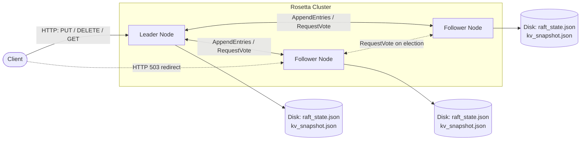
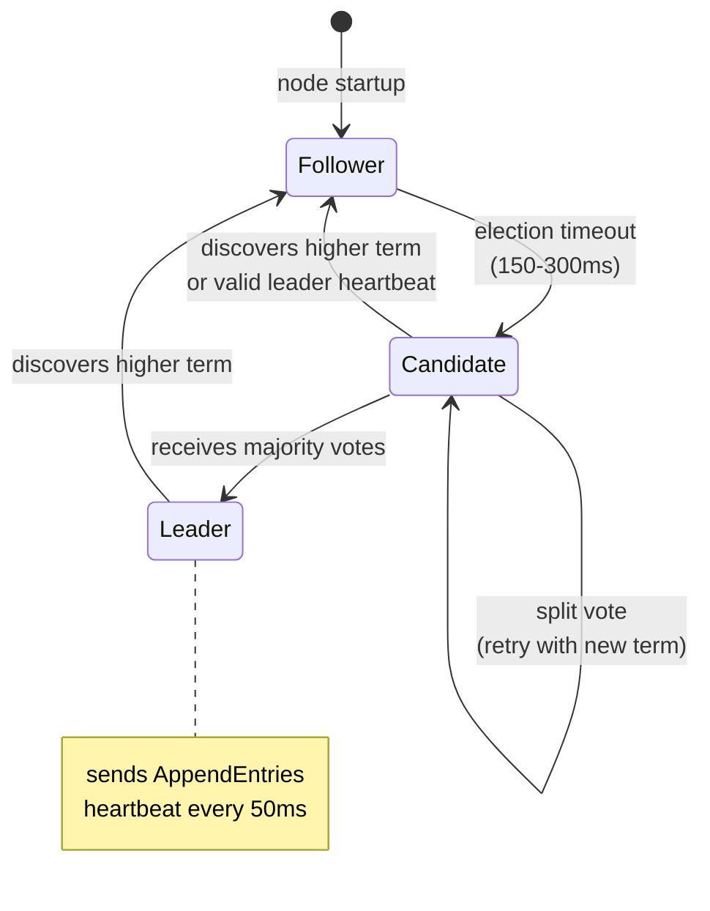

# Rosetta - Distributed Key-Value Store

A distributed key-value store implementation using the Raft consensus algorithm, written in Go. Provides strong consistency guarantees across multiple nodes through leader election, log replication, and safety properties defined by the Raft protocol.

## Features

- **Raft Consensus**: Implements the complete Raft protocol for distributed consensus
- **Strong Consistency**: Guarantees linearizable reads and writes across the cluster
- **Leader Election**: Automatic leader election with randomized timeouts
- **Log Replication**: Ensures all nodes maintain consistent state
- **Persistence**: Crash recovery with durable storage of Raft state and KV data
- **Log Compaction**: Automatic snapshotting prevents unbounded log growth
- **HTTP API**: RESTful interface for key-value operations
- **Fault Tolerance**: Handles node failures and network partitions
- **Testing Suite**: Comprehensive unit and integration tests

## Quick Start

### Build and Run

```bash
# Build the application
go build -o rosetta main.go

# Run a single node
./rosetta -id=node1 -listen=localhost:8080 -http=localhost:9080

# Run a 3-node cluster
./rosetta -id=node1 -listen=localhost:8080 -http=localhost:9080 -peers=node2:localhost:8081,node3:localhost:8082
./rosetta -id=node2 -listen=localhost:8081 -http=localhost:9081 -peers=node1:localhost:8080,node3:localhost:8082
./rosetta -id=node3 -listen=localhost:8082 -http=localhost:9082 -peers=node1:localhost:8080,node2:localhost:8081
```

### API Usage

```bash
# Store a key-value pair
curl -X PUT http://localhost:9080/kv -d '{"key":"hello","value":"world"}'

# Retrieve a value
curl http://localhost:9080/kv/hello

# Delete a key
curl -X DELETE http://localhost:9080/kv/hello

# Check node status
curl http://localhost:9080/status

# Get current leader
curl http://localhost:9080/leader
```

## Architecture

### Cluster Overview



Writes always go through the Leader; Followers redirect clients via HTTP 503. Each node independently persists its Raft state and KV snapshot for crash recovery.

### Raft State Transitions



Implemented in [`raft/state.go`](raft/state.go). Randomized election timeouts prevent split votes; any node that observes a higher term immediately steps down to Follower.

### Core Components

- **raft/**: Raft consensus algorithm implementation
  - State management (Follower/Candidate/Leader)
  - Log replication and consistency
  - RPC communication (RequestVote, AppendEntries)

- **kvstore/**: Key-value store built on Raft
  - PUT/GET/DELETE operations
  - Client request handling
  - State machine integration

- **network/**: Network communication layer
  - HTTP-based RPC transport
  - Cluster membership and discovery

- **config/**: Configuration management

### Key Design Patterns

- **Leader-Only Writes**: All mutations go through the leader node
- **Apply Channel**: Bridge between Raft consensus and state machine
- **Transport Abstraction**: Support for different transport implementations
- **Mock Testing**: Deterministic testing without network complexity

## Development

### Testing

```bash
# Run all tests
go test ./... -v

# Run unit tests only
go test ./tests/unit/... -v

# Run integration tests only
go test ./tests/integration/... -v

# Performance benchmarks
go test -bench=. -benchmem ./...

# Race condition detection
go test -race ./...
```

### API Endpoints

| Method | Endpoint | Description |
|--------|----------|-------------|
| PUT | `/kv` | Store key-value pair |
| GET | `/kv/{key}` | Retrieve value by key |
| DELETE | `/kv/{key}` | Delete key |
| GET | `/status` | Node status (term, leader state, log size) |
| GET | `/leader` | Current leader information |

## Configuration

Command line options:
- `-id`: Unique node identifier
- `-listen`: Raft RPC listen address
- `-http`: HTTP API listen address
- `-peers`: Comma-separated list of peer nodes

## Implementation Details

- **Election Timeouts**: Randomized timeouts (150ms + offset) prevent split votes
- **Log Consistency**: AppendEntries includes consistency checks with backtracking
- **Pending Operations**: Request tracking with unique IDs for client matching
- **State Persistence**: Durable storage of Raft state and log entries

## License

MIT License
