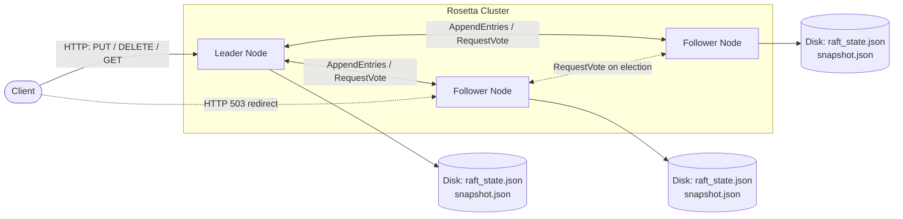
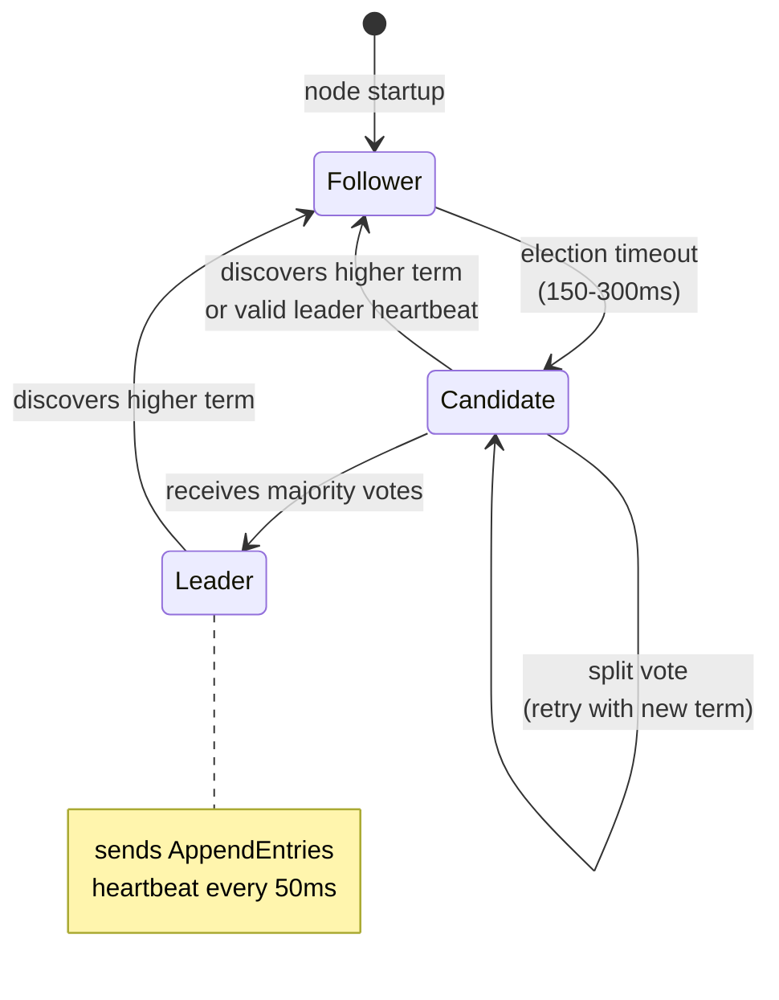

# Rosetta - Distributed Key-Value Store

A distributed key-value store implementation using the Raft consensus algorithm, written in Go, built from scratch as a learning project.

> **Project status: educational implementation — not for production use.**
> The core happy path works (leader election, log replication, HTTP KV API, crash
> recovery), but a full safety review against the Raft paper found confirmed
> violations of Raft's safety properties in several subsystems, most notably log
> compaction. The issues are tracked openly in [KNOWN_ISSUES.md](KNOWN_ISSUES.md),
> with the detailed analysis in
> [docs/safety-review-2026-07-07.md](docs/safety-review-2026-07-07.md).

## Features

- **Raft Consensus**: Leader election with randomized timeouts, log replication with consistency checks, and heartbeats. The two P0 findings of the 2026-09-06 re-audit on this path are fixed: the leader's append now checks leadership and appends durably under one lock (R1), and a follower no longer ACKs entries it failed to persist, not even on a resend (R2). Every path that steps down goes through one follower transition that re-arms the election timer, so a demoted leader still campaigns (R6); the two known data races are closed (E1, E2); and replication is serialized per peer with a follower's match/next index kept monotonic. Other Group R findings remain open — see [KNOWN_ISSUES.md](KNOWN_ISSUES.md)
- **Distributed KV Store**: PUT/GET/DELETE over an HTTP API, with leader-only writes and follower redirects
- **Persistence**: Crash recovery with atomic file writes *per file*; state is persisted before RPC replies. There is still no cross-file atomicity between the Raft state file and the KV snapshot file, but the write order now carries the guarantee: the snapshot payload is made durable before the Raft boundary, so a crash can only leave the snapshot ahead of the Raft state, and startup refuses to boot the unrecoverable direction — see [KNOWN_ISSUES.md](KNOWN_ISSUES.md) (R3, fixed)
- **Log Compaction / InstallSnapshot**: Absolute indexing (A1–A5), production snapshotter wiring (A6), follower snapshot persistence (A8), and the §7 receiver retention rule (A7) are all fixed — group A has no open safety issue. The three snapshot-path findings of the 2026-09-06 re-audit are fixed too: generation-consistent persistence with a startup check (R3), one immutable (index, term, data) envelope on the send path (R4), and monotonicity guards on both receivers so an older snapshot cannot roll applied state back (R5). The liveness gap on that receive path is closed as well: applying is done by a dedicated applier goroutine, so no handler holds `rs.mu` waiting for the state machine (B3). Snapshots are transferred in chunks as well (R15): the leader splits the payload into 64 KiB RPCs and the receiver changes nothing — not its Raft state, not the state machine, not either file — until the final chunk arrives, so an interrupted transfer leaves no trace and simply restarts. That bounds the size and duration of one RPC, not either end's memory. See [KNOWN_ISSUES.md](KNOWN_ISSUES.md)
- **Read Optimization**: Linearizable reads via the ReadIndex protocol (leader no-op on election + heartbeat-quorum confirmation), replacing the earlier lease-based reads — see [KNOWN_ISSUES.md](KNOWN_ISSUES.md) (D1–D3, fixed)
- **Testing Suite**: Unit and integration tests using a deterministic in-memory mock transport

## Quick Start

### Build and Run

```bash
# Build the application
go build -o rosetta main.go

# Run a single node
./rosetta -id=node1 -listen=localhost:8080 -http=localhost:9080

# Run a 3-node cluster
./rosetta -id=node1 -listen=localhost:8080 -http=localhost:9080 -peers=node2:localhost:8081,node3:localhost:8082
./rosetta -id=node2 -listen=localhost:8081 -http=localhost:9081 -peers=node1:localhost:8080,node3:localhost:8082
./rosetta -id=node3 -listen=localhost:8082 -http=localhost:9082 -peers=node1:localhost:8080,node2:localhost:8081
```

### API Usage

```bash
# Store a key-value pair
curl -X PUT http://localhost:9080/kv -d '{"key":"hello","value":"world"}'

# Retrieve a value
curl http://localhost:9080/kv/hello

# Delete a key
curl -X DELETE http://localhost:9080/kv/hello

# Check node status
curl http://localhost:9080/status

# Get current leader
curl http://localhost:9080/leader
```

## Architecture

### Cluster Overview


```mermaid
flowchart LR
    Client([Client])

    subgraph Cluster[Rosetta Cluster]
        direction TB
        Leader[Leader Node]
        F1[Follower Node]
        F2[Follower Node]

        Leader <-->|AppendEntries / RequestVote| F1
        Leader <-->|AppendEntries / RequestVote| F2
        F1 <-.->|RequestVote on election| F2
    end

    Client -->|HTTP: PUT / DELETE / GET| Leader
    Client -.->|HTTP 503 redirect| F1

    Leader --> DL[(Disk: raft_state.json<br/>snapshot.json)]
    F1 --> DF1[(Disk: raft_state.json<br/>snapshot.json)]
    F2 --> DF2[(Disk: raft_state.json<br/>snapshot.json)]
```

Writes always go through the Leader; Followers redirect clients via HTTP 503. Each node independently persists its Raft state and KV snapshot for crash recovery.

### Raft State Transitions


```mermaid
stateDiagram-v2
    [*] --> Follower: node startup

    Follower --> Candidate: election timeout<br/>(150-300ms)

    Candidate --> Leader: receives majority votes
    Candidate --> Follower: discovers higher term<br/>or valid leader heartbeat
    Candidate --> Candidate: split vote<br/>(retry with new term)

    Leader --> Follower: discovers higher term

    note right of Leader
        sends AppendEntries
        heartbeat every 50ms
    end note
```

Implemented in [`raft/state.go`](raft/state.go). Randomized election timeouts prevent split votes; any node that observes a higher term immediately steps down to Follower.

### Core Components

- **raft/**: Raft consensus algorithm implementation
  - State management (Follower/Candidate/Leader)
  - Log replication and consistency
  - RPC communication (RequestVote, AppendEntries)

- **kvstore/**: Key-value store built on Raft
  - PUT/GET/DELETE operations
  - Client request handling
  - State machine integration

- **network/**: Network communication layer
  - HTTP-based RPC transport
  - Membership changes go through Raft: `POST /cluster/add` / `POST /cluster/remove`
    on the leader append a configuration entry, and a change that moves the voter
    set goes through the joint configuration C_old,new to C_new (paper §6, R14,
    fixed). `GET /cluster/config` reports what a node is currently using. The
    transport's peer address book follows the configuration, so an added server is
    reachable without editing anyone's flags
  - An added server joins as a **learner**: it is replicated to but counted by no
    quorum, and the leader promotes it to a voter on its own once it has caught up
    (paper §6 "new servers join as non-voting members", R20, fixed). Learners are
    a transient catch-up state only — permanent read replicas are out of scope
  - `ClusterManager`'s `/cluster/join`, `/cluster/leave` and `/cluster/nodes`
    are HTTP-level bookkeeping only and are *not* part of that path — they are
    never reflected in the Raft quorum, are not served on a normal startup, and
    `-join` still fails startup rather than pretending otherwise (R12, fixed).
    See [KNOWN_ISSUES.md](KNOWN_ISSUES.md)

- **config/**: Configuration management

### Key Design Patterns

- **Leader-Only Writes**: All mutations go through the leader node
- **Apply Channel**: Bridge between Raft consensus and state machine
- **Transport Abstraction**: Support for different transport implementations
- **Mock Testing**: Deterministic testing without network complexity

## Development

### Testing

```bash
# Run all tests
go test ./... -v

# Run unit tests only
go test ./tests/unit/... -v

# Run integration tests only
go test ./tests/integration/... -v

# HTTP-level benchmark (no Go Benchmark functions exist; use the benchmark tool)
cd examples/benchmark && go build . && ./benchmark -url=http://localhost:9080
# see examples/benchmark/ for options, argument validation, and report format

# Race condition detection
go test -race ./...
```

### API Endpoints

| Method | Endpoint | Description |
|--------|----------|-------------|
| PUT | `/kv` | Store key-value pair |
| GET | `/kv/{key}` | Retrieve value by key |
| DELETE | `/kv/{key}` | Delete key |
| GET | `/status` | Node status (term, leader state, log size) |
| GET | `/leader` | Current leader information |

## Configuration

Command line options:
- `-id`: Unique node identifier
- `-listen`: Raft RPC listen address
- `-http`: HTTP API listen address
- `-peers`: Comma-separated list of peer nodes (format: `id:addr,id:addr`)
- `-config`: Configuration file path (JSON). There is no per-field command-line
  flag for anything below this table — the individual `-id`/`-listen`/`-http`/
  `-peers` flags above are the only way to set those fields without a file.
  `LoadConfig` starts from the defaults below and overlays whatever the file
  sets, so a file that only sets `node_id` still gets every other field's
  default rather than Go's zero value.

  | Key | Default | Meaning |
  |-----|---------|---------|
  | `node_id`, `listen_addr`, `http_server_addr`, `peers`, `data_dir` | see `-id`/`-listen`/`-http`/`-peers` above, `./data` | Same as the matching flag |
  | `election_timeout` | `150ms` | Election timeout **base**. The jitter added on top is the same length again, so the effective range is `[election_timeout, 2*election_timeout)` — 150-300ms at the default, matching raft's original hardcoded constants |
  | `heartbeat_timeout` | `50ms` | Leader heartbeat interval, which is also how often the node's internal event loop ticks |
  | `max_raft_state` | `1000` | Log entries applied before an automatic snapshot/compaction |
  | `snapshot_interval` | `100` | **Reserved, not read by anything yet** — automatic snapshotting is driven only by `max_raft_state` today. See [KNOWN_ISSUES.md](KNOWN_ISSUES.md) (R16) |
  | `log_level` | `"INFO"` | **Reserved, not read by anything yet** |
  | `http_read_timeout`, `http_write_timeout` | `10s` each | HTTP server timeouts |

  `Validate` rejects `election_timeout <= heartbeat_timeout` and, separately,
  `election_timeout < 2*heartbeat_timeout` (paper §5.2: broadcastTime should be
  much smaller than the election timeout, not merely smaller).
- `-join`: Reserved, and still **rejected** if given a non-empty value: startup
  fails fast with an error. Membership changes now exist, but they are granted by
  the leader (`POST /cluster/add`), not asserted by the joining node — which has
  no way to know whether the cluster agreed. `config.Validate` rejects a `-peers`
  list that includes this node's own ID, has two peers at the same address, or
  has a peer at this node's own listen address. See
  [KNOWN_ISSUES.md](KNOWN_ISSUES.md) (R12, fixed)

### Changing cluster membership

Start every node of the initial cluster with the same `-peers` list. After that,
add and remove servers through the leader rather than by editing flags:

```bash
# Start the new node with the EXISTING cluster's peers (not including itself).
./rosetta -id=node4 -listen=localhost:8083 -http=localhost:9083 \
  -peers=node1:localhost:8080,node2:localhost:8081,node3:localhost:8082

# Ask the leader to admit it (addr is the new node's Raft -listen address).
curl -X POST http://localhost:9080/cluster/add \
  -H 'Content-Type: application/json' \
  -d '{"node_id":"node4","addr":"localhost:8083"}'

# The response lists node4 under "learners": it is being caught up and counts
# towards no quorum yet. Poll until it appears under "voters" with no "learners"
# left and "joint": false -- the leader promotes it by itself.
curl http://localhost:9080/cluster/config

# Removing works the same way; the removed node can be shut down once it is gone
# from the configuration.
curl -X POST http://localhost:9080/cluster/remove \
  -H 'Content-Type: application/json' -d '{"node_id":"node2"}'
```

A node started with the existing cluster's peer list is not a voter in it, so it
does not campaign; it is admitted as a non-voting learner, and becomes a voter
when the leader sees it has caught up and appends the configuration promoting it.
Only one change at a time is accepted, and a learner still catching up *is* a
change in flight — the one thing allowed alongside it is removing that learner,
which abandons the addition. Removing the leader is allowed: it steps down once
C_new commits. Full details and error codes are in [docs/api.md](docs/api.md).

Cluster sizing: Raft needs a majority to commit, so run an odd number of nodes —
3 nodes tolerate 1 failure, 5 tolerate 2. Adding nodes does not make writes faster.

## Implementation Details

- **Election Timeouts**: Randomized timeouts (150ms + offset by default) prevent split votes; both the base and the heartbeat interval are configurable via `-config` (see Configuration above) — see [KNOWN_ISSUES.md](KNOWN_ISSUES.md) (R16, fixed)
- **Log Consistency**: AppendEntries includes consistency checks with backtracking
- **Pending Operations**: Request tracking with unique IDs for client matching. The tracking entry is registered before the command is submitted to Raft, not after, so a commit that completes unusually fast can never find nothing to deliver its result to — see [KNOWN_ISSUES.md](KNOWN_ISSUES.md) (R9, fixed)
- **State Persistence**: Durable storage of Raft state and log entries
- **At-Most-Once Writes — Conditional**: Duplicate detection (`ClientID`/`SeqNum`) only applies when a write carries a non-empty `ClientID` — a request without one gets no dedup, so retrying it after a timeout can still apply twice. The `kvstore.Client` Go client always sets one and serializes writes per `Client` instance (one in-flight write at a time; use a separate `Client` per concurrent writer) so its own internal retries (to a different server after a 503 or network error) reuse the same `SeqNum` and stay at-most-once. If every server fails, `Client.Put`/`Delete` return an error wrapping `kvstore.ErrResultUnknown`: calling `Put`/`Delete` again on the same `Client` after that allocates a new `SeqNum` and is not deduplicated against the uncertain attempt — see [KNOWN_ISSUES.md](KNOWN_ISSUES.md) (R10, fixed)

## Documentation

- [KNOWN_ISSUES.md](KNOWN_ISSUES.md) — live status of the confirmed safety issues (start here)
- [docs/README.md](docs/README.md) — documentation index
- [docs/api.md](docs/api.md) — HTTP API reference
- [docs/persistence.md](docs/persistence.md) — persistence and crash recovery
- [docs/log-compaction.md](docs/log-compaction.md) — log compaction design and current state
- [docs/raft-paper-implementation-status.md](docs/raft-paper-implementation-status.md) — Raft paper compliance status
- [docs/safety-review-2026-07-07.md](docs/safety-review-2026-07-07.md) — frozen safety review report (2026-07-07)
- [docs/textbook.md](docs/textbook.md) — in-depth walkthrough of the codebase

## License

MIT License
