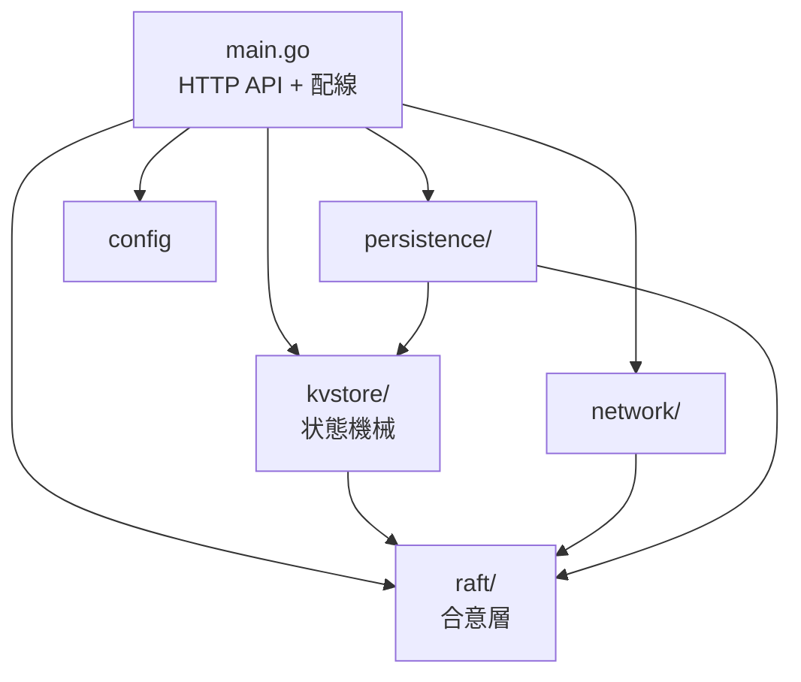
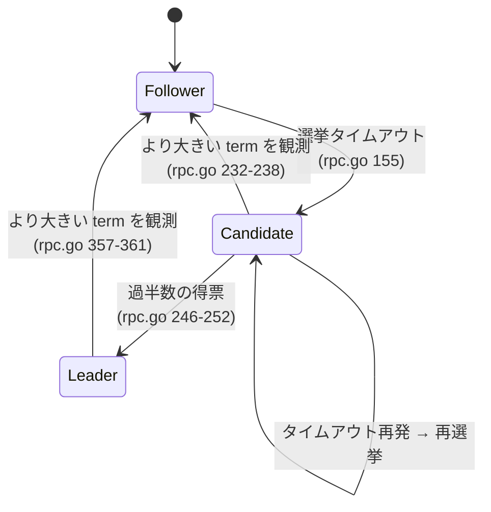
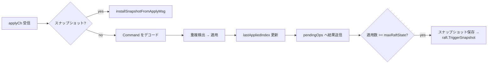
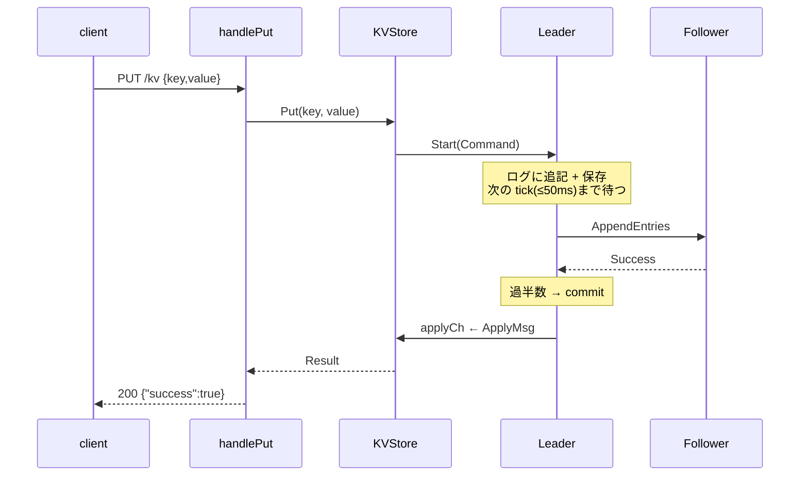

<!-- _class: lead -->

# rosetta 教科書

## Raft 合意アルゴリズムによる分散 KVS — コードから再構築した全体像

作成日: 2026-07-19
情報源: リポジトリの実ソースコード（main ブランチ、commit 9a90cf5 時点）

---

## この教科書の読み方

- **情報源はコードそのもの**。CLAUDE.md や docs/ の既存ドキュメントは検証対象であり、根拠にはしていない
- コードの根拠は `file:line` 形式で明記する（例: `raft/state.go:20`）
- 実行して確かめていない挙動は「**未検証**」と明示する（静的読解に基づく推論）
- 既存ドキュメントとの食い違いは 💥 マークで都度指摘し、終盤に総表を置く
- 各スライドの下部に、専門用語を使わない説明を 💡 付きで添えている

> 💡 **やさしく言うと**: この資料は「説明書を信じずに、機械の中身を実際に開けて確かめた記録」です。開けて確認できなかった部分には正直に「未確認」と書いてあります。

---

## プロジェクト概観

- モジュール名 `rosetta`、Go 1.23.4（`go.mod:1-3`）
- Raft 合意の上に線形化可能を目指す分散 KVS を実装
- コア実装は約 3,800 行、テスト込みで約 7,000 行

| パッケージ | 行数 | 役割 |
|---|---|---|
| `raft/` | 1,605 | 合意層(選挙・複製・スナップショット) |
| `kvstore/` | 813 | 状態機械 + HTTP クライアント |
| `network/` | 530 | HTTP RPC トランスポート + 未配線のディスカバリ |
| `persistence/` | 425 | ファイル永続化 |
| `config/` | 175 | 設定（半分はデッドフィールド） |
| `main.go` | 287 | HTTP API サーバー + 全体の配線 |

> 💡 **やさしく言うと**: 複数のコンピュータで同じデータ帳簿を持ち合い、どれか 1 台が壊れても帳簿が失われない「合鍵つき金庫の分散版」を自作しているプロジェクトです。

---

## パッケージ依存関係



- `raft` が最下層。`persistence` は `raft` と `kvstore` の両方に依存（`persistence/kv_snapshotter.go:7`）
- `network` は Raft RPC の運搬のみを担い、KV の HTTP API は `main.go` が直接ホストする

> 💡 **やさしく言うと**: 部品同士の「どれがどれを頼っているか」の地図です。土台は raft で、他の部品はみなその上に乗っています。

---

## 起動時の配線（main.go:223-269）

1. `FileStorage` 作成: データ置き場は `<DataDir>/<NodeID>`（`main.go:224-228`）
2. `RaftPersister` と `KVSnapshotter` を作成（`main.go:232-233`）
3. `KVStore` 作成（`MaxRaftState` とスナップショッタを注入、`main.go:236`）
4. `HTTPTransport` 作成 + peers 設定（`main.go:239-240`）
5. `RaftNode` 作成（生成と同時にイベントループ起動、`main.go:243`）
6. `kvs.SetRaft` / `transport.SetRaftNode` で相互接続（`main.go:245-246`）

> 💡 **やさしく言うと**: プログラム起動時に部品を組み立てて互いにつなぐ手順書です。ここでつなぎ忘れた部品は、その後ずっと動きません（次のスライド）。

---

## 💥 配線されて「いない」もの（重要）

起動処理（main.go）が呼んでいない接続が 2 つある:

- `raftNode.SetSnapshotter(...)` は **一度も呼ばれない**
  → リーダーは遅れた仲間にスナップショットを送れない（第1章末で詳述）
- `ClusterManager.StartDiscovery()` は **一度も呼ばれない**
  → クラスタ参加用の `/cluster/*` エンドポイントは本番で存在しない（第3章で詳述）

> 💡 **やさしく言うと**: 機能の部品は作ってあるのに、最後のコンセントが挿さっていない箇所が 2 つあります。見た目には存在する機能が、実際には一度も動きません。

---

## 最初に知るべきこと: ドキュメントは 3 世代が混在

| 世代 | ドキュメント | 前提 |
|---|---|---|
| 第1世代 | deployment.md / troubleshooting.md / performance.md | 「永続化は未実装・メモリのみ」 |
| 第2世代 | README.md / log-compaction.md / raft-paper-implementation-status.md / CLAUDE.md | 「永続化・圧縮・重複検出は実装済み」 |
| 第3世代 | **safety-review-2026-07-07.md** | 「実装は存在するが多数が壊れている/未配線」 |

- **コードの実態に最も近いのは第3世代**（本書の精読でほぼ裏付けられた）
- 例外: safety-review の B1（applyCh でのコミット済みエントリ破棄）は commit 9a90cf5 で修正済み

> 💡 **やさしく言うと**: 説明書が古い順に 3 冊あり、互いに矛盾しています。一番新しい「点検報告書」が最も現実に近い、というのが本書の結論です。

---

<!-- _class: lead -->

# 第1章 Raft 合意層（raft/）

---

## raft/ のファイル構成

| ファイル | 行数 | 内容 |
|---|---|---|
| `state.go` | 316 | `RaftState`（状態・永続状態・タイマー・read lease） |
| `node.go` | 246 | `RaftNode`（イベントループ）+ **`MockTransport`** |
| `rpc.go` | 615 | RPC 型定義・全ハンドラ・選挙・複製・コミット |
| `log.go` | 222 | `LogEntry`・ログ操作・apply 処理 + デッドコード `LogManager` |
| `snapshot.go` | 206 | スナップショット機構（`Snapshotter` インターフェース） |

💥 テスト用の `MockTransport` の定義はテストファイルではなく**本番ファイル `raft/node.go:172-246`** にある

> 💡 **やさしく言うと**: Raft は「多数決でリーダーを選び、リーダーが全員の帳簿を揃える」ための取り決めです。この章ではその実装 5 ファイルを順に見ます。

---

## ノード状態と遷移



- 状態は `Follower / Candidate / Leader` の 3 値（`raft/state.go:10-16`）

> 💡 **やさしく言うと**: 各サーバーは「一般メンバー→立候補者→リーダー」の 3 つの顔を持ちます。リーダーからの連絡が途絶えると誰かが立候補し、多数決で新リーダーが決まります。

---

## 状態遷移の補足ルール

- AppendEntries（リーダーからの連絡）を受けたノードは、stale でなければ Follower に戻り、`currentLeader` を更新する（`raft/rpc.go:110-112`）
- リーダーになったノードは選挙タイマーを停止する（`raft/rpc.go:251`、単一ノード時は `rpc.go:184`）
- term（任期番号）はすべての判断の基準。自分より大きい term を見たら無条件で従う

> 💡 **やさしく言うと**: 「任期番号」は選挙のたびに 1 増える通し番号です。より新しい任期の相手に出会ったら、自分の主張を取り下げて従う——これが混乱を防ぐ基本ルールです。

---

## タイミング定数 — すべてハードコード

すべて `raft/state.go:18-36` の定数。**config からは変更できない**（第5章参照）。

| 定数 | 値 | 用途 |
|---|---|---|
| 選挙タイムアウト | 150ms + rand(0–150ms) | リーダー不在とみなすまでの待ち時間 |
| `heartbeatInterval` | 50ms | リーダーの生存連絡の周期 |
| `raftTickInterval` | 50ms | イベントループの tick |
| `requestVoteTimeout` | 100ms | 投票依頼 RPC の上限 |
| `appendEntriesTimeout` | 50ms | ログ複製 RPC の上限 |
| `installSnapshotTimeout` | 5s | スナップショット転送 RPC の上限 |

💥 CLAUDE.md「150ms + ノード固有オフセット」は誤り。実際は**タイマーをリセットするたびに再乱択**（`state.go:238-245`、初期化時も `state.go:130-133`）

> 💡 **やさしく言うと**: 「どれくらい連絡が来なかったら選挙を始めるか」は毎回サイコロで決め直します。全員の待ち時間がバラバラになるので、同時立候補で票が割れる事故が起きにくくなります。

---

## 状態の持ち方（state.go）

```go
type PersistentState struct {          // state.go:51-59
    CurrentTerm int          // 任期番号
    VotedFor    *string      // この任期で誰に投票したか
    Log         []LogEntry   // 命令の帳簿
    LastIncludedIndex int    // スナップショット境界
    LastIncludedTerm  int
}
type VolatileState struct { CommitIndex, LastApplied int }        // state.go:61-64
type LeaderState  struct { NextIndex, MatchIndex map[string]int } // state.go:66-69
```

- `peers []string` は**自分自身を含む**（`config/config.go:130-137` が自 ID を先頭に入れる）。ループでは `peer != rs.nodeID` でスキップ

> 💡 **やさしく言うと**: 「電源が切れても残すべきメモ（任期・投票先・帳簿）」と「消えてもよい作業メモ」を分けて持っています。この区別が壊れると、停電後に過去の約束を忘れてしまいます。

---

## 永続化の実行と、その弱点

- 永続化は `persist()`（`state.go:177-185`）経由。persister が nil なら黙って何もしない
- **書き込みエラーはログ出力のみで無視**（`state.go:182-184`）— ディスク書き込みに失敗しても選挙・投票は続行してしまう（safety-review C3、未修正）

> 💡 **やさしく言うと**: 大事なメモをノートに書き写す係がいますが、「書けませんでした」と言われても作業を止めずに進んでしまいます。停電が重なると、書けなかったメモの内容を永久に失います。

---

## イベントループ（node.go:37-51）

```go
for {
    select {
    case <-rn.done:                    // Kill()
    case <-rn.state.ElectionTimer():   // → 選挙開始
    case <-ticker.C:                   // 50ms ごと → リーダーなら複製送信
    }
}
```

- コンストラクタ内で goroutine として起動（`node.go:33`）
- **`Start()`（コマンド受付）は複製を即時トリガーしない**。ログに積むだけで（`node.go:83-96`）、次の tick（最大 50ms 後）に相乗りして複製される
- → 書き込みレイテンシの下限が実質 tick 周期（50ms）で決まる

> 💡 **やさしく言うと**: このプログラムの心臓は 50ms ごとに 1 回打つ鼓動です。新しい注文が来ても即座には配らず、次の鼓動のタイミングでまとめて配ります。速さより単純さを取った設計です。

---

## リーダー選挙の流れ（rpc.go:155-254）

1. `startElection`: term++、自分に投票、`currentLeader` クリア、**persist**（`rpc.go:156-161`）
2. 必要票数は `len(peers)/2 + 1`（`rpc.go:171`）
3. 単一ノードクラスタなら即座に Leader へ（`rpc.go:177-186`）
4. 各 peer へ goroutine で並行に投票依頼（`rpc.go:191-197`）
5. 応答処理: term/状態が変わっていたら無視、より大きい term を見たら降格 + persist、過半数で Leader 昇格（`rpc.go:225-253`）

> 💡 **やさしく言うと**: 「リーダーが倒れたようだ」と気づいたメンバーが任期番号を 1 上げて立候補し、全員に同時に投票依頼を送ります。過半数の賛成を集めた瞬間にリーダー就任です。

---

## 選挙まわりの既知の問題（未修正・未検証）

- `ResetElectionTimer` を**ロック外**で呼んでいる（`rpc.go:174`）
  → `electionTimeout` フィールドへのデータレース（safety-review E1）
- **当選時に no-op エントリを積まない**
  → Raft 論文 §8 の推奨に反する。新リーダーが過去の任期のエントリをコミットできない期間が生じ、読み取りの正しさに影響（後述 D3）

> 💡 **やさしく言うと**: 2 つの小さな抜けがあります。1 つは複数人が同時に同じメモ帳に書き込める状態になっていること。もう 1 つは、新リーダーが就任のあいさつ（空の一筆）を帳簿に書かないため、前任者の残した仕事を確定させるきっかけを失うことです。

---

## RequestVote 受信側 — 投票の判断（rpc.go:59-92）

- 古い term からの依頼は拒否（`rpc.go:66-68`）。新しい term なら term 更新 + Follower 化（`rpc.go:70-74`）
- 選挙制限（§5.4.1）: 候補者のログが自分と同等以上に新しい場合のみ投票（`rpc.go:83-84`）
- 投票したら選挙タイマーをリセット（`rpc.go:87`）

> 💡 **やさしく言うと**: 投票には条件があります。「私より帳簿が古い候補者には入れない」。帳簿が欠けた人がリーダーになると、確定済みの記録が失われかねないからです。

---

## 💥 重大: 投票が記録されない（safety-review C1）

RequestVote ハンドラは term 更新（`rpc.go:71`）も投票（`rpc.go:85`）も**一度も `persist()` しない**。

- 投票直後にクラッシュ → 再起動すると「誰に投票したか」を忘れる
- → **同一 term に二重投票**でき、同じ任期に 2 人のリーダーが成立し得る（Election Safety 違反。クラッシュ再現は未検証）
- 💥 docs/persistence.md:76-81「投票時に persist する」はコードと不一致

> 💡 **やさしく言うと**: 投票所で投票した記録を紙に残していません。停電後に「まだ投票していない」と思い込んで別の候補にも投票でき、1 つの選挙で当選者が 2 人出る恐れがあります。分散システムでは致命傷になり得る種類の不具合です。

---

## AppendEntries 受信側 — 帳簿の受け取り（rpc.go:94-153）

処理順序:

1. 古い term は拒否 → term 更新 → **Follower 化 + `currentLeader` 記録 + タイマーリセット**（`rpc.go:101-112`）
2. 整合性チェック + fast rollback（次スライド）
3. エントリがあれば `Log[:PrevLogIndex]` に切り詰めて追記、Index を振り直し、persist（`rpc.go:134-144`）
4. リーダーのコミット位置に追随して commit・apply（`rpc.go:146-149`）

> 💡 **やさしく言うと**: リーダーから帳簿の続きが届いたら、「あなたの帳簿の◯ページ目は私と同じ内容ですか？」という確認をしてから書き足します。ページがズレていたら受け取りを断り、リーダーにやり直させます。

---

## AppendEntries の既知の問題（未修正・未検証）

- **切り詰めが無条件**: 論文 §5.3 は「既存エントリと衝突する場合のみ削除」だが、この実装はエントリ付き RPC を受けると常に `PrevLogIndex` まで切り詰める（`rpc.go:135-137`）
  → ネットワーク遅延で古い RPC が後から届くと、コミット済みの末尾を失い得る（safety-review B2）
- ハートビート等での term 更新（`rpc.go:105-108`）は persist されない（safety-review C2）

> 💡 **やさしく言うと**: 届いた手紙が実は「昔書かれた手紙の遅配」だった場合に、最新の帳簿の後ろを消して古い内容で上書きしてしまう抜け穴があります。通常は起きませんが、通信が乱れたときに確定済みの記録が消える恐れがあります。

---

## Fast rollback 最適化（§5.3 拡張）

follower 側（`rpc.go:114-132`）:

- ログが短すぎる → `ConflictTerm=-1, ConflictIndex=len(Log)+1`
- term 不一致 → その term の**最初の index** を後方走査で求めて返す

leader 側 `handleReplicationConflict`（`rpc.go:387-415`）:

- `ConflictTerm=-1` → `NextIndex = ConflictIndex`
- leader がその term を持つ → その term の最後のエントリの次へジャンプ
- 持たない → `ConflictIndex` へジャンプ（下限 1 を保証、`rpc.go:412-414`）

> 💡 **やさしく言うと**: 帳簿がズレていたとき、1 ページずつ遡って探すのではなく「この章ごと違います」と教え合って章単位でジャンプする工夫です。大きくズレた仲間との帳簿合わせが速く終わります。

---

## ハートビート = 複製（rpc.go:256-382）

rosetta には「空のハートビート」という概念が実質なく、**50ms ごとの送信が常に `NextIndex` 以降の全エントリを載せて送る**（`rpc.go:325-328`）。

`replicateToPeer`（`rpc.go:297-382`）の流れ:

1. `NextIndex` からスナップショット境界を考慮して `prevLogIndex/Term` を算出（`rpc.go:313-323`）
2. `NextIndex` が圧縮済み領域なら InstallSnapshot 経路へ（`rpc.go:332-335`）
3. 成功: `MatchIndex/NextIndex` 前進 + コミット判定（`rpc.go:368-371`）
4. 過半数の成功応答で read lease を更新（`rpc.go:374-378`）
5. 失敗: fast rollback（`rpc.go:380`）

> 💡 **やさしく言うと**: リーダーは 50ms ごとの生存連絡に「あなたにまだ渡していない帳簿の続き」を毎回同封します。連絡と配達を 1 つの便でまとめている、と考えてください。

---

## 複製の注意点（静的読解・未検証）

- 送信エントリは `rs.persistent.Log` のスライスを**そのまま**渡す（`rpc.go:327`）
- HTTP 経由なら JSON 化（コピー）されるので実害はないが、**MockTransport では送信側と受信側が同じメモリ（backing array）を共有**したまま処理が進む（safety-review E2）
- テストと本番で挙動が変わり得る点として覚えておく

> 💡 **やさしく言うと**: 本番では書類をコピーして郵送しますが、テスト環境では原本をそのまま手渡ししています。テストでだけ「同じ紙に 2 人が同時に書き込む」事故が起き得ます。

---

## コミット規則（rpc.go:465-487）

```go
for n := rs.volatile.CommitIndex + 1; n <= len(rs.persistent.Log); n++ {
    if rs.persistent.Log[n-1].Term != rs.persistent.CurrentTerm { continue }  // §5.4.2
    // MatchIndex >= n の peer を数え、過半数なら CommitIndex = n
}
```

- **現 term のエントリのみ直接コミット**（§5.4.2 に忠実、`rpc.go:471`）。過去 term のエントリは現 term のエントリが積まれたときに間接的に確定する
- ただし当選時に no-op を積まないため（D3）、**新リーダーは次の書き込みが来るまで過去 term のエントリをコミットできない**

> 💡 **やさしく言うと**: 「コミット」とは、過半数のメンバーに行き渡った記録を「もう取り消せない確定事項」と宣言することです。ただし新リーダーは、自分の任期の新しい記録を 1 件書くまで、前任者の記録を確定できない縛りがあります。

---

## apply 経路（log.go:202-222）

```go
for rs.volatile.LastApplied < rs.volatile.CommitIndex {
    rs.volatile.LastApplied++
    entry := rs.persistent.Log[rs.volatile.LastApplied-1]
    rs.applyCh <- applyMsg   // ブロッキング送信（log.go:220）
}
```

- commit 9a90cf5 で「バッファ満杯時に黙って捨てる」から**ブロッキング送信**に修正済み（safety-review B1 の修正。安全性は回復）
- ただしこの関数は **`rs.mu`（大域ロック）を保持したまま**呼ばれる。バッファは 100（`kvstore/store.go:23`）。消費側が遅いと **RPC 処理がロックごと停止する** liveness 問題は残る（applier goroutine 分離が既知 TODO）

> 💡 **やさしく言うと**: 確定した命令を実際にデータ庫へ反映する係へ、ベルトコンベアで流します。以前は満杯時に品物を床に落としていました（修正済み）。今は満杯なら流れが止まるだけですが、止まっている間は他の仕事も一緒に止まります。

---

## read lease — 読み取りの近道（state.go:300-316）

`CanServeReadOnlyQuery`:

- Leader であり、かつ「過半数からのハートビート成功確認」から `electionTimeout` 以内なら、Raft を通さずローカル読みを許可
- lease 更新はレプリケーション応答の過半数到達時（`rpc.go:374-378`）と単一ノードの tick（`rpc.go:270-276`）

> 💡 **やさしく言うと**: リーダーは「ついさっき過半数が自分をリーダーと認めた」なら、読み取りだけは全員に確認せず手元の帳簿から即答します。毎回全員に聞くより桁違いに速い近道です。

---

## read lease の既知の弱点（safety-review D1/D2、未修正・未検証）

- lease の有効期間に**自分の**乱択 `electionTimeout` を流用している。他ノードはそれぞれ別の（より短いかもしれない）値を持つため、自分の lease が切れる前に他所で新リーダーが立ち得る
- lease の起点が「応答を**受信した**時刻」（送信時刻ではない）なので、通信往復のぶん lease が実質延長される

> 💡 **やさしく言うと**: 「さっき皆に認められたから大丈夫」の「さっき」の測り方が甘く、自分がまだリーダーのつもりでも、よそで新リーダーが誕生している瞬間があり得ます。その瞬間の即答は古い情報かもしれません。

---

## スナップショット機構の全体像（snapshot.go）

```go
type Snapshotter interface {        // snapshot.go:16-27
    CreateSnapshot(lastIncludedIndex, lastIncludedTerm int) ([]byte, error)
    InstallSnapshot(data []byte, lastIncludedIndex, lastIncludedTerm int) error
    ReadSnapshot() ([]byte, error)
}
```

本番で実際に動く経路は 1 本だけ:

- kvstore が閾値到達で自分のスナップショットを保存 → `RaftNode.TriggerSnapshot`（`kvstore/store.go:294`）→ 非同期で `TruncateLogTo`（`node.go:156-163` → `snapshot.go:151-179`）がログを切り詰めて境界を更新

> 💡 **やさしく言うと**: 帳簿が延々と伸び続けないよう、「ここまでの結果の写真（スナップショット）」を撮って古いページを破り捨てる仕組みです。写真さえあれば古いページは要らない、という理屈です。

---

## スナップショット API の使用実態

以下は**テストからしか呼ばれない**（プロダクションコードに呼び出しなし、grep で確認）:

- `TakeSnapshot`（`snapshot.go:30`）
- `InstallSnapshotFromData`（`snapshot.go:86`）
- `ShouldTakeSnapshot`（`snapshot.go:182`）
- `GetLastLogIndexWithSnapshot` / `GetLastLogTermWithSnapshot`（`snapshot.go:189-206`）

> 💡 **やさしく言うと**: 道具箱にはスナップショット用の道具が 5 つ入っていますが、本番の組み立てで使われているのは 1 つだけ。残りはテストの中でしか握られていません。「あるのに使われていない」は本書の頻出パターンです。

---

## InstallSnapshot RPC 受信側（rpc.go:530-594）

1. 古い term 拒否 / term 更新（この経路は persist **する**、`rpc.go:541-546`）
2. Follower 化 + タイマーリセット（`rpc.go:551-553`）
3. 古いスナップショット（境界以下）は無視（`rpc.go:556-558`）
4. スナップショットに覆われるエントリを破棄し、境界・CommitIndex・LastApplied を前進、persist（`rpc.go:561-582`）
5. `SnapshotValid=true` の ApplyMsg を **`rs.mu` 保持のままブロッキング送信**（`rpc.go:585-593`）

注意（未検証）: 手順 4 は境界より後のエントリを **term 検査なしで**保持する（`rpc.go:562-566`）。分岐したサフィックスが生き残ると Log Matching が破れ得る（safety-review A7）

> 💡 **やさしく言うと**: 大きく遅れた仲間には帳簿の続きではなく「現在の結果の写真」を丸ごと送って追いつかせます。ただし受け取り側が、写真より後の自分の古いメモを無検査で残してしまう抜けがあります。

---

## 💥 最重要: ログ圧縮は「送信側だけ」実装されている

圧縮境界（`LastIncludedIndex`）を考慮した絶対 index ⇄ スライス位置の変換をするのは `replicateToPeer`（`rpc.go:303-328`）**のみ**。以下は全て「index = 配列位置 + 1」を仮定したまま:

| 経路 | 問題箇所 |
|---|---|
| RequestVote 受信 | `rpc.go:77-80` が `len(Log)` を lastLogIndex に使用 |
| 選挙開始 | `rpc.go:163-167` 同上 |
| AppendEntries 受信 | `rpc.go:115-142` が絶対 index を切り詰め後の配列に直接適用 |
| コミット判定 | `rpc.go:470` `n <= len(Log)`（絶対値 vs 相対長） |
| apply | `log.go:205` `Log[LastApplied-1]` |
| 再起動 | `state.go:140` volatile が 0 から |

> 💡 **やさしく言うと**: 古いページを破り捨てると、残ったページの「通し番号」と「物理的な位置」がズレます。この換算を送信係しかやっておらず、他の係は全員ズレたまま帳簿をめくっています。

---

## 圧縮の不整合が引き起こすこと（静的読解・未検証）

| 経路 | 帰結 |
|---|---|
| 投票まわり | 圧縮後のノードが「短いログ」を名乗り、投票判断が歪む（Leader Completeness に影響） |
| AppendEntries 受信 | 圧縮済み follower への複製が壊れる |
| コミット判定 | リーダー自身が圧縮すると**コミットが恒久停止** |
| apply | 誤ったエントリ適用 / 配列範囲外 panic の可能性 |
| 再起動 | 圧縮後状態での復帰時に整合しない |

いずれも safety-review A1–A5 に対応。未修正

> 💡 **やさしく言うと**: ページ番号のズレを放置すると、「選挙で自分の実績を過小申告する」「配達が届かなくなる」「確定作業が永久に止まる」「違う命令を実行する」など、あらゆる持ち場で事故が起きます。

---

## 💥 さらに: InstallSnapshot は本番で永久に発火しない

- リーダーが写真を送るには `rs.snapshotter` が必要だが、`SetSnapshotter` の呼び出しは**リポジトリ全体で 0 件**。nil なら黙って return（`rpc.go:426-429`）
- そもそも `raft.Snapshotter` を実装する本番の型が存在しない。`persistence.KVSnapshotter` が実装するのは別インターフェース `kvstore.Snapshotter(V2)`
- 受け皿の `installSnapshotFromApplyMsg` も V1 形式（生の map）を仮定（`kvstore/store.go:305-309`）しており、実際に保存される V2 形式 `{"kv_data":...,"sessions":...}`（`persistence/kv_snapshotter.go:41-43`）とは**形式不一致**（未検証）

> 💡 **やさしく言うと**: 「写真を送って追いつかせる」機能は、送る側のカメラが接続されておらず、届いても受け取り側が封筒の形式を読めません。二重に断線しています。

---

## 圧縮まわりの実務的な結論

- `MaxRaftState` は既定 1000（`config/config.go:14`）→ **本番でも 1000 コマンド適用で圧縮が発火する**
- マルチノード運用でここを超えると前述の不整合域に入る
- 圧縮を無効化したくても、`Validate` が `MaxRaftState <= 0` を拒否する（`config/config.go:123-125`）ため**設定では無効化できない**
- 💥 log-compaction.md「0 で無効化できる」と矛盾

> 💡 **やさしく言うと**: この危険な仕組みは初期設定のままだと「1000 件書き込んだら自動で作動」します。しかも設定画面から止める方法がありません。修理するまでは長時間の連続運用を避けるべき、が現実的な結論です。

---

## デッドコード: LogManager（log.go:14-122）

- `LogManager` は独立したログ管理クラスで、`AppendEntry / GetEntry / TruncateAfter / AppendEntries` 等を持つ
- しかし **`RaftState` は使っておらず**（`rs.persistent.Log` を直接操作）、テストからも参照ゼロ（grep で確認）
- `RaftState.UpdateCommitIndex`（`log.go:191`）と `TruncateLogAfter`（`log.go:179`）も呼び出し 0 件
- 読解時の罠: `AppendEntries` という同名メソッドが 2 箇所（`log.go:79` と `rpc.go:94`）にあるが、**生きているのは rpc.go 側だけ**

> 💡 **やさしく言うと**: 昔の改築で使われなくなった部屋が取り壊されずに残っています。間取り図を読むとき、同じ名前の部屋が 2 つあって片方は空き部屋——これを知らないと迷子になります。

---

<!-- _class: lead -->

# 第2章 KVStore（kvstore/）

---

## KVStore の構造（store.go:69-87）

| フィールド | 役割 |
|---|---|
| `data map[string]string` | 状態機械の本体（キーと値の表） |
| `applyCh chan raft.ApplyMsg`（buffer 100） | Raft → 状態機械の橋（`store.go:23,94`） |
| `pendingOps map[string]chan Result` | リクエストと適用結果の突き合わせ |
| `sessions map[string]*ClientSession` | 重複検出（ClientID → 最終 SeqNum/結果） |
| `maxRaftState int` | スナップショット発火閾値 |

- コンストラクタでスナップショットをロードし、`applyLoop` goroutine を起動（`store.go:108-116`）
- `Close()` は applyCh を閉じて applyLoop を終える（`store.go:546-548`）

> 💡 **やさしく言うと**: ここが「実際にデータを覚えている本体」です。ただし直接は書き込ませず、必ず Raft の多数決を通ってきた命令だけをベルトコンベア（applyCh）経由で反映します。

---

## 書き込み経路（store.go:448-496）

1. リーダーでなければ即 `"not leader"` エラー（`store.go:453-455`）
2. `opID = "<nodeID>-<UnixNano>"` を発行（`store.go:457`）
3. Command を JSON 化して `raft.Start` へ（**文字列として**ログに入る、`store.go:470`）
4. `pendingOps[opID]` に結果チャネルを登録し、**5 秒**待つ（`store.go:475-495`）
5. 結果受信後、term が変わっていたら `"leadership lost"` を返す（`store.go:485-488`）

注意: 手順 5 は結果が**適用済み**でも term 変化だけでエラーにするため、成功した書き込みにエラーを返すことがあり得る（safety-review D5、未修正・未検証）

> 💡 **やさしく言うと**: 書き込みは「受付番号を発行 → 多数決に回す → 自分の番号の結果が戻るのを最大 5 秒待つ」という流れです。まれに、実は成功しているのに「失敗しました」と答えてしまう癖があります。

---

## applyLoop — 命令を反映する係（store.go:238-300）



> 💡 **やさしく言うと**: ベルトコンベアの終点に立つ係です。流れてきた命令をデータ表に反映し、待っている受付に結果を渡し、一定件数ごとに「写真撮影と古いページの廃棄」を発注します。

---

## applyLoop の注意点

- Command のデコードは `fmt.Sprintf("%v", ...)` 経由という荒い方法（`store.go:254`）。Start に渡すのが JSON 文字列なので結果的に動く
- 💥 **race**: `pendingOps` からの `delete` を `opMu.RLock()`（読み取り用ロック）保持下で実行（`store.go:271-279`）。読み取りロックのまま map を書き換えており、並行 PUT で競合し得る（未検証。`-race` での再現未確認）
- スナップショット発火条件は「**プロセス起動後に適用したコマンド数** >= maxRaftState」（`store.go:282-283`）であり、ログの長さではない。💥 CLAUDE.md の説明と意味が違う

> 💡 **やさしく言うと**: 「閲覧専用の鍵」を持ったまま棚の中身を捨てている箇所があります。他の人が同時に棚を触ると壊れる恐れがある、教科書的なロックの使い間違いです。

---

## PUT の一生（正常系シーケンス）



> 💡 **やさしく言うと**: 1 件の書き込みは「受付 → 帳簿に記入 → 仲間に配達 → 過半数の受領確認 → 確定 → 反映 → 返事」という 7 段階の旅をします。

---

## 書き込みレイテンシの内訳

- 支配項は **tick 周期 50ms**（`Start` が即時複製しないため、次のハートビートまで待つ）
- そこに RPC 往復（LAN なら数 ms）と適用処理が乗る
- 理論下限 ≈ 50ms + α。スループットを上げたい場合、複数の書き込みが同じ tick に相乗りしてまとめて複製される点が効く

> 💡 **やさしく言うと**: 書き込みが約 50ms より速くならないのは、配達トラックが 50ms に 1 本しか出ないダイヤだからです。ただし 1 本のトラックに何件でも相乗りできるので、件数が増えても遅くなりにくい性質があります。

---

## GET の 2 経路（store.go:403-424）

```go
if kvs.raft.CanServeReadOnlyQuery() {
    return kvs.getLocal(key)        // lease 有効: ローカル読み（数 µs）
}
result := kvs.executeOperationWithResult(OpGet, key, "")  // lease なし: Raft 経由
```

- lease 有効時はローカル map を直接読む（`store.go:428-437`）
- lease 無効時（非リーダー含む）は GET も Raft ログを通す。非リーダーなら `"not leader"` → HTTP 503
- 💥 CLAUDE.md「GET は状態を変えないから安全」という説明は不正確。安全性の根拠は lease であり、その lease に既知の弱点がある（第1章参照）

> 💡 **やさしく言うと**: 読み取りには「即答の近道」と「念のため多数決を通す正規ルート」の 2 つがあり、リーダーの自信の有無で切り替わります。近道の安全根拠には前述の弱点があります。

---

## 💥 重複検出（§8）— 実装されている部分

`store.go:339-397` に一式が存在する:

- `sessions[ClientID]` が「そのクライアントの最終 SeqNum と結果」をキャッシュ
- SeqNum が過去 → `"stale request"` エラー
- SeqNum が同一 → **再実行せず**キャッシュした結果を返す
- SeqNum が新規 → 実行してキャッシュ更新

> 💡 **やさしく言うと**: 同じ注文書が 2 回届いても 2 回作らないための仕組みです。注文書に「お客様番号と通し番号」を書いてもらい、同じ番号なら前回の結果を渡すだけにします。

---

## 💥 重複検出 — しかし配線されていない

- HTTP ハンドラ `handlePut` は `PutArgs` の ClientID/SeqNum をデコードするのに、**`kvs.Put(req.Key, req.Value)` で捨てる**（`main.go:78-84`）
- サーバー内部で作る Command は ClientID を設定しない（`store.go:458-463`）
- 一方 `kvstore/client.go` は律儀に ClientID/SeqNum を生成・送信している（`client.go:80-92,107-118`）— **受け手が捨てるので無意味**

結論: 重複検出はテスト経由でのみ動く（safety-review D4 と一致）。タイムアウト後のクライアントリトライは二重適用され得る（未検証）

> 💡 **やさしく言うと**: お客は注文書に番号をきちんと書いているのに、受付が番号欄を破り捨ててから厨房に回しています。仕組みは全部あるのに、受付のたった 1 行のせいで「二重注文防止」が機能していません。

---

## スナップショットの保存と復元（kvstore 側）

- 保存: `saveSnapshot`（`store.go:176-205`）は V2 インターフェースがあれば `SnapshotData{KVData, Sessions}` を、なければ KV map のみを保存
- 復元: 起動時 `loadSnapshot`（`store.go:120-173`）が V2 → V1 の順に試す
- `persistence.KVSnapshotter` は読み込み時に V2 形式を試してから V1 にフォールバック（`persistence/kv_snapshotter.go:61-83`）
- 💥 ただし **InstallSnapshot RPC 経由の受信**（`store.go:302-319`）だけは V1 形式を仮定しており、V2 で保存されたデータと不一致（第1章参照）

> 💡 **やさしく言うと**: 写真の保存形式には旧版（データのみ）と新版（データ+お客様番号台帳）があり、読み込みは両対応です。ただし「仲間から郵送で受け取る」経路だけ旧版しか読めません。

---

## HTTP クライアント（client.go）— 基本動作

- リーダー追跡: `servers` 配列の index を「現リーダー候補」とし、接続エラーまたは **503** で次のサーバーへローテーション（`client.go:120-180`）
- `X-Raft-Leader` ヘッダは**利用していない**（総当たり方式）
- ClientID: 起動時に 128bit 乱数で生成（`client.go:59-66`）、Put/Delete で SeqNum を単調増加させて送信
- GET は ClientID を送らない（`client.go:94-105`）。タイムアウト 5 秒（`client.go:21`）

> 💡 **やさしく言うと**: このお客さん係は「今のリーダーは誰か」を教えてもらわず、断られたら隣のサーバーに順番に聞き直す方式です。単純ですが、サーバーが増えると遠回りが増えます。

---

## 💥 client.go の Batch API は片翼

- `Batch / PutBatch / GetBatch`（`client.go:216-265`）は `POST /kv/batch` を叩く
- しかし**サーバー側にこのエンドポイントは存在しない**（`main.go:43-47` の登録は `/kv`, `/kv/`, `/status`, `/leader` のみ）
- ルーティング上は `/kv/` にフォールバックして `handlePut` が処理する可能性すらあり、いずれにせよ意図通りには動かない（未検証）

> 💡 **やさしく言うと**: 「まとめ買い注文書」の書式はお客側に用意されていますが、店側にまとめ買い窓口がありません。送っても普通の窓口に紛れ込んで、想定外の処理をされます。

---

<!-- _class: lead -->

# 第3章 ネットワーク層（network/）

---

## HTTPTransport（transport.go）

- Raft RPC 用のエンドポイントを 1 つの HTTP サーバーでホスト（`transport.go:54-74`）:
  - `POST /raft/requestvote` / `POST /raft/appendentries` / `POST /raft/installsnapshot`
- 送信側は Go ジェネリクスの `sendRPC[Reply]`（`transport.go:100-134`）、受信側は `handleRaftRPC[Args, Reply]`（`transport.go:185-203`）で共通化。RPC の種類ごとの差は URL とハンドラ参照だけ
- ボディは素の JSON。認証・TLS・圧縮なし
- タイムアウト: クライアント 5s、サーバー read/write 各 10s（`transport.go:16-25`）

> 💡 **やさしく言うと**: サーバー同士の連絡は、ふつうの Web の仕組み（HTTP + JSON）でやり取りしています。暗号化も合言葉もないので、信頼できる内側のネットワークでしか使えません。

---

## transport.go の注意点（静的読解・未検証）

- `handleInstallSnapshot` だけ `raftNode` の nil チェックがない（`transport.go:250-257`）
- RequestVote/AppendEntries ハンドラは nil を許容する（`transport.go:205-219`）のに対し、`SetRaftNode` 前に InstallSnapshot を受けると **panic** する
- 実運用では `transport.Start()` 前に SetRaftNode されるため顕在化しにくい（`main.go:246-248`）

> 💡 **やさしく言うと**: 3 つの窓口のうち 1 つだけ、「まだ担当者が着席していないときに客が来たら」の対処を忘れています。今の開店手順では起きにくいものの、手順を変えると即クラッシュする地雷です。

---

## 💥 discovery.go は本番でほぼ死んでいる（1/2）

`ClusterManager` は `/cluster/join`, `/cluster/leave`, `/cluster/nodes` を提供する設計（`discovery.go:99-116`）だが:

1. **`StartDiscovery()` の呼び出しはリポジトリ全体で 0 件**。main.go は `ClusterManager` を作って peers を入れるだけ（`main.go:252-255`）→ `/cluster/*` はどのノードも serve していない
2. よって `-join` フラグ（`main.go:196`）で `JoinCluster` しても、相手に該当エンドポイントがなく失敗する（エラーはログに出して続行、`main.go:257-261`）

> 💡 **やさしく言うと**: 「新しいメンバーが合流を申請する受付窓口」のプログラムはあるのに、どのサーバーもその窓口を開けていません。合流を申請しても誰も電話に出ない状態です。

---

## 💥 discovery.go は本番でほぼ死んでいる（2/2）

3. 仮に窓口が開いても、`ClusterManager` の nodes は **Raft の `peers` に反映されない**。`RaftState.peers` は起動時の値で固定（`state.go:82,138`）

結論: 動的メンバーシップ（Raft 論文 §6）は未実装。discovery.go は将来のための骨組みが配線されずに残っている。`LeaveCluster` はシャットダウン時に呼ばれる（`main.go:281`）が、通知先が窓口を開けていないので実質 no-op

> 💡 **やさしく言うと**: そもそも Raft 本体が「メンバーは起動時に決めた顔ぶれで固定」という作りなので、途中参加の仕組みは受付だけでなく本体側も未対応です。メンバーを変えたければ全員を再起動するしかありません。

---

<!-- _class: lead -->

# 第4章 永続化層（persistence/）

---

## 構成 — 誰が何を実装しているか

| 型 | ファイル | 実装するインターフェース |
|---|---|---|
| `Storage`（iface） | `interface.go:6-21` | — |
| `FileStorage` | `file_storage.go` | `Storage` |
| `RaftPersister` | `raft_persister.go`（27 行の薄い委譲） | `raft.Persister` |
| `KVSnapshotter` | `kv_snapshotter.go` | `kvstore.Snapshotter` + `SnapshotterV2` |

> 💡 **やさしく言うと**: 「電源が切れても消えないノートに書く係」がこの章の主役です。Raft の記録係と KV の写真係が、同じノート置き場（FileStorage）を共用しています。

---

## ディスク上の実ファイル

ファイル名は `file_storage.go:14-17` で定義:

- **`<data-dir>/<node-id>/raft_state.json`** — term / votedFor / log / スナップショット境界
- **`<data-dir>/<node-id>/snapshot.json`** — 状態機械スナップショット

💥 CLAUDE.md と README.md の「`kv_snapshot.json`」は誤り。正しくは `snapshot.json`

> 💡 **やさしく言うと**: 保存されるファイルは 2 つだけです。1 つは Raft の帳簿と選挙記録、もう 1 つはデータ表の写真。説明書に書かれたファイル名は現物と食い違っています。

---

## アトミック書き込み（file_storage.go:34-57）

```
temp ファイルに書く → fsync(temp) → rename → fsync(親ディレクトリ)
```

- rename の原子性により「半分だけ書けたファイル」は残らない
- パーミッションはファイル 0600 / ディレクトリ 0700（`file_storage.go:19-22`）
- `LoadRaftState` はファイルがなければ**空の初期状態を正常値として返す**（`file_storage.go:92-99`）— 「初回起動」と「データ消失」を区別できない（safety-review C4 の背景）
- おまけ: `CopyTo`（バックアップ）、`DeleteAll`、`ListFiles`（`file_storage.go:203-261`）

> 💡 **やさしく言うと**: 書き込み途中に停電しても壊れたファイルが残らないよう、「下書きに書いてから一瞬で差し替える」方式です。ただし、ファイルが見当たらないとき「新品」なのか「消えた」のか区別せず新品扱いする癖があります。

---

## 💥「スナップショットのハッシュ重複検出」は存在しない

CLAUDE.md の主張:

> The Snapshotter component maintains a hash of the last snapshot to detect duplicates（ハッシュ比較で同一なら書き込みスキップ）

- **persistence/ 配下に hash という文字列は 1 箇所もない**（grep で確認）
- `KVSnapshotter` は毎回無条件に JSON を書く（`kv_snapshotter.go:21-33`）

> 💡 **やさしく言うと**: 「同じ写真は二度現像しない節約機能がある」と説明書に書いてありますが、探しても存在しません。毎回律儀に現像しています。

---

## 「Duplicate Detection」という語の混乱

このリポジトリでは同じ言葉が 2 つの別機能を指している:

1. CLAUDE.md が言う「スナップショット書き込みの重複回避」→ **実装が存在しない**
2. 実際にコードにあるのは「クライアントリクエストの重複検出」（ClientID/SeqNum、第2章）→ 実装はあるが**未配線**

つまりどちらの意味でも「Duplicate Detection ✅」は成立していない

> 💡 **やさしく言うと**: 「重複検出」という同じ名前の機能が 2 つあると思ってください。1 つは幻（存在しない）、もう 1 つは未接続（動かない）。説明書の ✅ マークはどちらの意味でも実態と合いません。

---

<!-- _class: lead -->

# 第5章 設定（config/）と HTTP API（main.go）

---

## Config — 実際に効くフィールド

| フィールド | 既定値 | 用途 |
|---|---|---|
| `NodeID` / `ListenAddr` / `HTTPServerAddr` | node1 / :8080 / :9080 | ✅ main.go で使用 |
| `Peers` | {} | ✅ transport と Raft peers に |
| `DataDir` | ./data | ✅ `<DataDir>/<NodeID>`（`main.go:224`） |
| `MaxRaftState` | 1000 | ✅ スナップショット発火閾値（`main.go:236`） |
| `HTTPReadTimeout` / `HTTPWriteTimeout` | 10s | ✅ HTTP サーバー（`main.go:52-53`） |

> 💡 **やさしく言うと**: 設定ファイルのうち、本当に機械の挙動を変えられるのはこの表の項目だけです。

---

## 💥 Config — 効かないフィールド（デッド設定）

| フィールド | 既定値 | 実態 |
|---|---|---|
| `ElectionTimeout` | 150ms | ❌ 未使用（raft はハードコード定数） |
| `HeartbeatTimeout` | 50ms | ❌ 未使用（同上） |
| `SnapshotInterval` | 100 | ❌ 未使用 |
| `LogLevel` | INFO | ❌ 未使用 |

- `Validate` は未使用フィールドまで検証する（`config.go:111-121`）— 「設定できるが効かない」罠
- CLI フラグは `-config -id -listen -http -peers -join` のみ（`main.go:190-197`）。💥 DataDir を CLI から変える手段はない

> 💡 **やさしく言うと**: 設定画面につまみが 4 つ余分に付いていますが、配線されておらず、回しても何も変わりません。しかも「不正な値だとエラーにする」検査だけは律儀に働きます。

---

## HTTP API — 実際のレスポンス（main.go）

| エンドポイント | 実際の応答 | 💥 api.md の記載（誤り） |
|---|---|---|
| `PUT/POST /kv` | `{"success":true}`（`main.go:96-98`） | `{"status":"success","key"}` |
| `GET /kv/{key}` | `{"success":true,"value":...}`（`main.go:125-128`） | `{"key","value"}` |
| `DELETE /kv/{key}` | `{"success":true}`（`main.go:150-152`） | `{"status":"deleted",...}` |
| `GET /status` | `node_id, term, is_leader, log_size`（`main.go:159-164`） | `state, log_length, commit_index` 等 |
| `GET /leader` | `{"leader":"<id>"}`（`main.go:170-173`） | `{"leader_id","leader_addr","term"}` |

> 💡 **やさしく言うと**: 窓口の受け答えの形式が、説明書（api.md）と全項目で食い違っています。説明書を見てプログラムを書くと必ず動きません。現物の返事に合わせる必要があります。

---

## リダイレクトとエラー処理の実際

- 非リーダーへの書き込み: **503 + プレーンテキスト** `Not leader. Current leader: <id>` + `X-Raft-Leader` ヘッダ（`main.go:86-89`）。api.md の JSON エラー形式ではない
- エラー分岐は `strings.Contains(err.Error(), "not leader")` という文字列マッチ（`main.go:85` 等）— エラーメッセージの文言を変えると分岐が壊れる
- `/leader` が返すのは**ノード ID のみ**でアドレスではない。接続先に変換するには外部知識が要る（client.go が総当たり方式なのはこのため）

> 💡 **やさしく言うと**: 「担当が違います、リーダーは◯◯さんです」と教えてはくれますが、◯◯さんの住所は教えてくれません。またエラーの見分け方が「文面にこの言葉が入っているか」なので、文面を変えただけで壊れます。

---

## /status の log_size は圧縮で縮む

- `log_size` は `GetLogLength` = `len(rs.persistent.Log)`（`node.go:122-124`、`log.go:163-167`）
- ログ圧縮が起きるとこの値は**切り詰め後の残エントリ数**になり、通算のログ長ではなくなる
- 監視でこの値を「書き込み総数」として扱うと、圧縮のたびに減って見える（未検証だがコード上自明）

> 💡 **やさしく言うと**: 状態表示の「帳簿の厚さ」は、古いページを破り捨てるたびに薄く見えます。グラフにすると突然ガクッと下がるので、故障と見間違えないよう注意してください。

---

<!-- _class: lead -->

# 第6章 テスト戦略（tests/）

---

## テストの全体構成

2 層構成:

1. **ユニットテスト**（`tests/unit/`、7 ファイル）— `NewRaftState` でトランスポートなしに RPC ハンドラを直接呼び、純ロジックを検証
2. **統合テスト**（`tests/integration/`、3 ファイル）— `MockTransport` で同一プロセス内クラスタを組む

> 💡 **やさしく言うと**: 検査は 2 段階です。まず部品単体を机上で検査し、次に部品を組んだミニチュアのクラスタ（1 台のパソコンの中に仮想の 3〜5 台）で通し検査をします。

---

## ユニットテストの対象マップ

| ファイル | 主対象 |
|---|---|
| `raft_test.go` | 状態遷移・投票・fast rollback（Conflict 3 パターン）・read lease |
| `persistence_test.go` | FileStorage の保存/復元/アトミック性（`.tmp` が残らない） |
| `duplicate_detection_test.go` | ClientID/SeqNum 機構（※Command を直接組んで検証 = 未配線問題は素通り） |
| `snapshot_test.go` | スナップショット境界・InstallSnapshot 受信 |
| `config_test.go` / `kvstore_test.go` | 設定・KV 基本操作 |
| `consts_test.go` | goconst linter 対策の共通定数のみ |

> 💡 **やさしく言うと**: 検査項目の一覧表です。注意点は「重複検出」の検査方法で、受付（HTTP 窓口）を通さず厨房に直接注文書を渡して検査しているため、受付が番号を捨てる問題（第2章）には気づけません。

---

## MockTransport の仕組み（raft/node.go:172-246）

- `nodes map[string]*RaftNode` を持つだけの登録簿。RPC 送信 = **対象ノードのハンドラメソッドを直接呼ぶ**（`node.go:199, 213, 227`）
- 未登録ノード宛は `context.DeadlineExceeded` を返す（`node.go:194-196`）— これが「ネットワーク到達不能」の模擬
- 障害・パーティション = `RemoveNode` で外す、回復 = 再登録
- 直列化を経ないため、引数のポインタ・スライスは送受で**メモリ共有**される（第1章 E2 の背景）

> 💡 **やさしく言うと**: テスト用の「なんちゃってネットワーク」です。実際の通信はせず、名簿を引いて相手の関数を直接呼びます。名簿から消せば「通信不能」を演じられるので、故障の実験が自在にできます。

---

## 統合テストのシナリオ（1/2）

`tests/integration/cluster_test.go`:

- `TestThreeNodeCluster` / `TestFiveNodeCluster`: リーダーがちょうど 1 人選出される
- `TestLeaderElectionAfterFailure`（:113）: リーダー Kill → 再選出
- `TestLogReplication`（:183）: 3 コマンドが全ノードに行き渡る
- `TestNetworkPartition`（:240）: 5 ノードを 3/2 に分割 → 多数派で選出 → 回復後も単一リーダー
- `TestConcurrentCommands`（:321）: 10 並行 `Start` が全部成功

> 💡 **やさしく言うと**: ミニチュアのクラスタで「リーダーは 1 人だけ選ばれるか」「リーダーが倒れたら交代できるか」「ネットワークが真っ二つに割れても混乱しないか」といった防災訓練をしています。

---

## 統合テストのシナリオ（2/2）

`persistence_integration_test.go`:

- クラッシュ模擬（Kill + 同一 persister で再生成）で term/votedFor/log と KV データが復元される
- 5 連続クラッシュで term が後退しない

`snapshot_compaction_test.go:82` `TestInstallSnapshotCatchUp`:

- **late-joiner** パターン: 2 ノードで 30 コマンド → 圧縮 → 3 台目を後から接続し、InstallSnapshot 経由で追いつくことを検証
- ただしテスト内の `fakeSnapshotter`（:16）を **`SetSnapshotter` で手動配線**して成立させている — 本番配線の欠如をテストが偶然すり抜けている構図

> 💡 **やさしく言うと**: 「停電から復帰しても記憶が戻るか」「遅れて合流した仲間が写真で追いつけるか」も訓練済みです。ただし後者は、本番では挿さっていないコンセントを検査員が手で挿して合格させています。

---

## テストの待ち方と既知の欠陥

- 初期のテストは固定 `time.Sleep`（300–500ms でリーダー選出待ち、200ms で複製待ち）
- 後発のテストは条件ポーリング（`pollForSingleLeader`、`waitForLeader` 等）に移行しつつある — 不安定さ（flakiness）対策としてはこちらが正
- 💥 `cluster_test.go:378` に **SA4011**（ineffective break）が現存: タイムアウト時の `break` が `select` を抜けるだけで外側 `for` を抜けない。ラベル付き break か return が必要（既知 TODO）

> 💡 **やさしく言うと**: 古い検査は「3 秒待てば終わってるはず」方式、新しい検査は「終わったか確認しながら待つ」方式です。また 1 箇所、「検査を打ち切ったつもりが打ち切れていない」書き間違いが残っています。

---

## テストが検出「できていない」もの

safety-review の CONFIRMED 群のうち、テストで守られているものはほぼない:

- 圧縮後のマルチノード複製・コミット（A 系）— 圧縮後に通常運転を続けるテストがない
- RequestVote 経路の persist 欠如（C1）— クラッシュタイミングを突くテストがない
- 重複検出の HTTP 未配線（D4）— テストは Command を直接組む
- lease の線形化可能性（D1–D3）— 検証手段がない

**「全テスト green」と「安全」は別物**という好例

> 💡 **やさしく言うと**: 検査が全部合格でも、それは「検査した範囲では問題なし」という意味でしかありません。今の検査は、点検報告書が指摘した危険な状況（停電の瞬間、ページ破棄後の長期運転など)をそもそも再現していないのです。

---

<!-- _class: lead -->

# 第7章 既知の問題・TODO と設計への影響

---

## safety-review-2026-07-07.md の現在値

本書の精読で各指摘の現状を突き合わせた結果（commit 9a90cf5 時点）:

| グループ | 内容 | 現状 |
|---|---|---|
| B1 | applyCh 満杯時にコミット済みエントリを破棄 | ✅ **修正済み**（`log.go:213-220`） |
| B2 | AppendEntries の無条件切り詰め | ❌ 未修正（`rpc.go:135-137`） |
| B3 | rs.mu 保持のまま applyCh 送信 | ⚠️ 現仕様（安全だが liveness 課題） |
| A1–A8 | 圧縮の index 体系が送信側のみ / SetSnapshotter 未配線 | ❌ 未修正 |
| C1–C4 | 投票・term 更新の persist 欠如ほか | ❌ 未修正 |
| D1–D5 | lease 期間・起点、no-op 不在、重複検出未配線 | ❌ 未修正 |
| E1–E2 | ロック外タイマーリセット、スライス共有 | ❌ 未修正 |

> 💡 **やさしく言うと**: 点検報告書の指摘 21 件のうち、直ったのは最重症だった 1 件だけです。残りは今もそのままなので、次の改修はこの表を持ち場の一覧として使えます。

---

## TODO.md / CLAUDE.md ロードマップとの突き合わせ

- 💥 TODO.md「Log Compaction — Status: Not Started」は誤り。実装は存在し（`raft/snapshot.go` 全体、`kvstore/store.go:281-298`）、**既定で有効**。正しい表現は「半実装・本番構成では危険」
- メトリクス / Prometheus エンドポイント: 未実装（`/status` の 4 フィールドのみ）— ここは TODO.md と一致
- 動的メンバーシップ（§6）: 未実装。discovery.go の骨組みだけ存在（第3章）
- ドキュメント整備: 本書の 💥 一覧が示す通り、api.md / README.md / CLAUDE.md の実装記述は要全面改訂

> 💡 **やさしく言うと**: 「やることリスト」自体が現状とズレています。「まだ着手していない」と書かれた機能が実は動いていて（しかも危険な状態で）、直すべきなのはリストの前提のほうです。

---

## 短期の実務的インパクト（オーナーとしての判断材料）

1. **マルチノード本番運用は 1000 コマンドで危険域に入る**（`MaxRaftState` 既定値）。config では無効化できない（`Validate` が 0 を拒否）
   → 圧縮統合の完成 or 発火の一時停止が最優先級
2. 修正順序は safety-review の推奨が妥当: **C 系（persist）→ B2 → A 系（圧縮）→ D 系（読み取り）**。B1 は完了済み

> 💡 **やさしく言うと**: 今いちばん急ぐのは「1000 件書いたら自動で作動してしまう危険な機能」を止めるか完成させるかです。次が「停電しても投票記録を失わないようにする」こと。この 2 つが済むまで本番運用は勧められません。

---

## ズレ総表: ドキュメント vs コード実態（1/3）

| # | ドキュメントの主張 | コードの実態 |
|---|---|---|
| 1 | 選挙タイムアウトは「150ms + ノード固有オフセット」(CLAUDE.md) | リセット毎に再乱択 150–300ms（`state.go:238-245`） |
| 2 | スナップショットは `kv_snapshot.json`（CLAUDE.md, README） | `snapshot.json`（`file_storage.go:16`） |
| 3 | スナップショットのハッシュ重複検出あり（CLAUDE.md） | 存在しない（persistence/ に hash なし） |
| 4 | 重複検出は実装済み（raft-paper-status.md） | 機構はあるが HTTP 経路から未配線（`main.go:84`） |
| 5 | log compaction 未着手（CLAUDE.md, TODO.md） | 半実装・既定で有効・送信側のみ index 変換 |

> 💡 **やさしく言うと**: ここから 3 枚は「説明書と現物の食い違い」の総まとめです。レビューや改修の前に、この表で思い込みをリセットしてください。

---

## ズレ総表: ドキュメント vs コード実態（2/3）

| # | ドキュメントの主張 | コードの実態 |
|---|---|---|
| 6 | InstallSnapshot でフォロワーが追いつく（log-compaction.md） | 本番では `SetSnapshotter` 未配線で永久に発火しない |
| 7 | 投票時・term 更新時に persist（persistence.md:76-81） | RequestVote ハンドラは persist しない（`rpc.go:59-92`） |
| 8 | `/status` は state/log_length/commit_index 等を返す（api.md） | node_id/term/is_leader/log_size のみ（`main.go:159-164`） |
| 9 | `/leader` は leader_addr と term を返す（api.md） | `{"leader":"<id>"}` のみ（`main.go:170-173`） |
| 10 | 503 は JSON エラー（api.md） | プレーンテキスト + `X-Raft-Leader` ヘッダ（`main.go:86-89`） |

> 💡 **やさしく言うと**: 特に 6 と 7 は「動くはずの安全装置が動かない」種類のズレで、単なる誤記より深刻です。

---

## ズレ総表: ドキュメント vs コード実態（3/3）

| # | ドキュメントの主張 | コードの実態 |
|---|---|---|
| 11 | `max_raft_state: 0` で圧縮無効化（log-compaction.md） | `Validate` が 0 を拒否（`config.go:123-125`） |
| 12 | 永続化は未実装（deployment/troubleshooting/performance.md） | 実装済み（第1世代ドキュメントの更新漏れ） |
| 13 | ベンチのフラグは `-nodes`（CLAUDE.md:234） | `-url`（`examples/benchmark/benchmark.go`） |
| 14 | Batch API が使える（client.go の存在が示唆） | サーバー側エンドポイント不在（`main.go:43-47`） |
| 15 | config で選挙/ハートビート間隔を設定可（見かけ上） | 未使用フィールド。raft はハードコード定数 |

> 💡 **やさしく言うと**: 12 のように「実装済みなのに未実装と書いてある」逆方向のズレもあります。古い説明書を読んで「作らなきゃ」と二重実装するのも典型的な事故なので要注意です。

---

## examples の実態（補足）

- `examples/simple-cluster/`: `start.sh` が 3 ノード（8080-8082 / 9080-9082）をログ付きで起動し `/status` を整形表示。`demo.sh` は PUT/GET → フォロワー kill → リーダー kill → 再選出 → DELETE の対話式デモ。`stop.sh` は pgrep で全ノードを graceful kill
- `examples/benchmark/benchmark.go`: HTTP 経由の負荷ツール。`-url -ops -concurrency -read-ratio -duration` 等を持ち、read/write 別に Min/Max/Mean/P50/P95/P99 とスループットを出力
- どちらも**単一プロセス障害までの動作確認が主目的**。圧縮発火後（1000+ コマンド）の長時間運用シナリオは examples にもテストにもない

> 💡 **やさしく言うと**: 付属のお試しセットは「3 台で動かして壊して直す」体験までは面倒を見てくれますが、「長く使い続けたらどうなるか」は誰も試していません。危険域はまさにそこにあります。

---

## まとめ — 信頼してよい部分

テストと精読の両方で裏付けが取れているもの:

- 圧縮前・ハッピーパスの選挙 / 複製 / fast rollback / コミット規則（§5.4.2 準拠）
- FileStorage のアトミック書き込みと基本のクラッシュ回復
- MockTransport による決定的なテスト基盤

> 💡 **やさしく言うと**: 「普通に 3 台で動かして、たまに 1 台壊れる」くらいの世界では、このシステムはきちんと動きます。土台の出来は悪くありません。

---

## まとめ — 触る前に必ず思い出すべき部分

- ログ圧縮は「送信側だけ」実装。既定で発火し、config で止められない
- persist は「ログ追記・選挙開始」経路のみ。投票・ハートビート経由の term 更新は揮発
- 重複検出・Batch・discovery・LogManager は未配線またはデッドコード
- ドキュメントは 3 世代混在。**迷ったら safety-review-2026-07-07.md と本書、最後はコード**

次に機能追加やレビューをするときは、この教科書の 💥 と「未検証」印を出発点にすること。

> 💡 **やさしく言うと**: 覚えて帰るのは 3 つ。「1000 件書くと危険な機能が勝手に動く」「停電すると投票記録が消える」「説明書より現物を信じる」。この 3 つを押さえていれば、このコードベースで道に迷いません。

<!-- Mermaid 描画スクリプト: `marp --html` で HTML 出力したときのみ動作する。閲覧にはネット接続が必要（CDN からロード） -->
<script type="module">
import mermaid from "https://cdn.jsdelivr.net/npm/mermaid@11/dist/mermaid.esm.min.mjs";
mermaid.initialize({ startOnLoad: false, theme: "default" });
const blocks = document.querySelectorAll("pre code.language-mermaid, marp-pre code.language-mermaid");
let i = 0;
for (const code of blocks) {
  const pre = code.closest("pre, marp-pre");
  const graph = code.textContent;
  const el = document.createElement("div");
  el.className = "mermaid-svg";
  el.style.textAlign = "center";
  pre.replaceWith(el);
  const { svg } = await mermaid.render("mermaid-" + i++, graph);
  el.innerHTML = svg;
}
</script>
